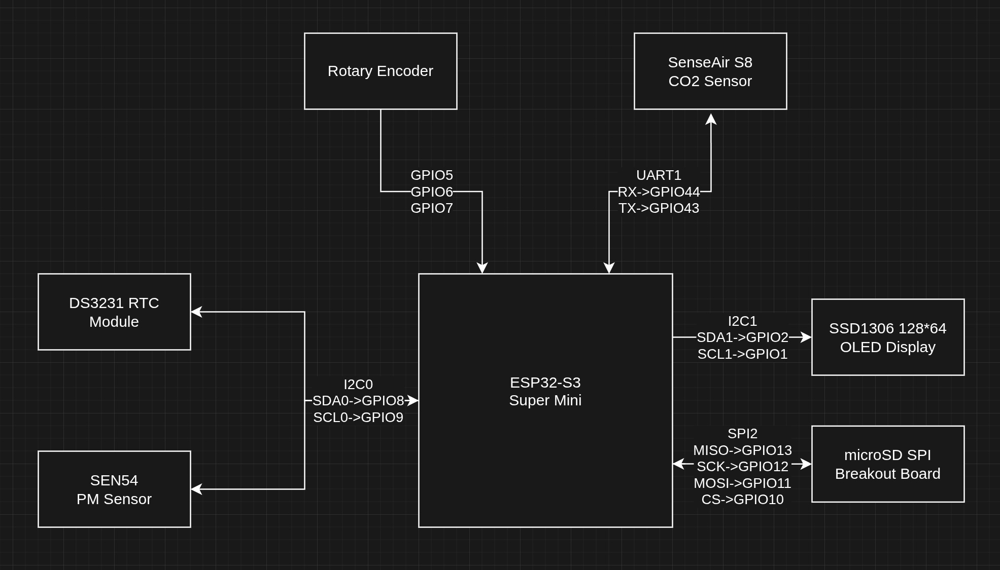
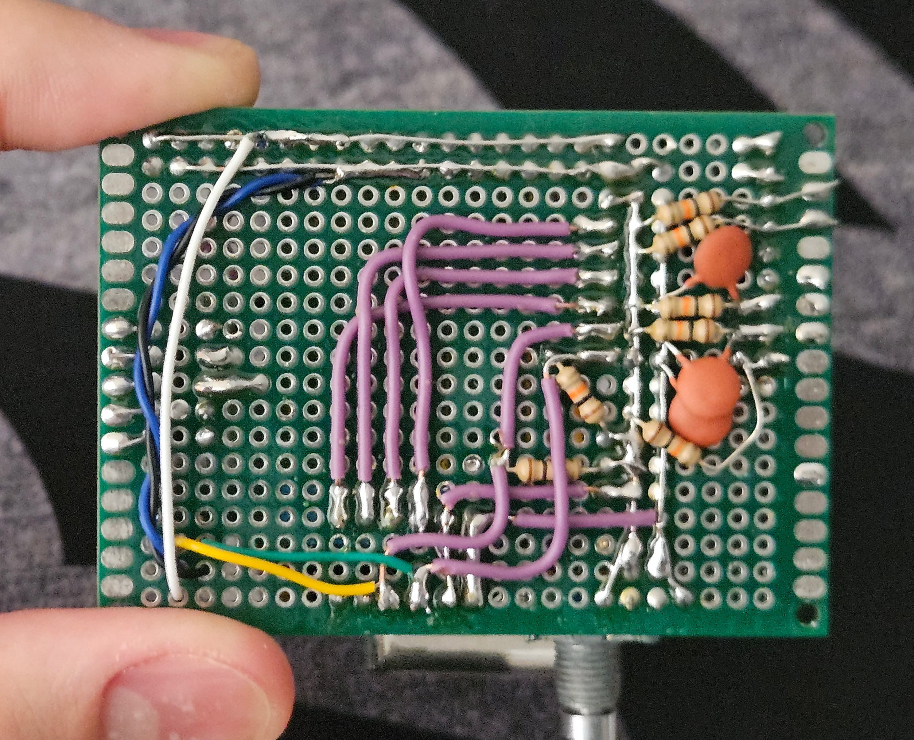

# Air Quality Monitor and Logger


## 1. Introduction & Overview
The primary goal of this project was to measure pollutants that were created from FDM 3D printing and learn some embedded programming along the way.
First version of this project was made with the same hardware but on a mini RP2040 dev board and using Arduino IDE. After making it work, I realized that my main air pollutant was not 3D printing related. It was cigarette smoke from family members smoking nearby and it was seriously affecting the air quality (PM2.5 levels of around 200-300 ug/m3 while the normal level is around 5 ug/m3).
So I decided to switch from the RP2040 with another board with wireless functionality to be able to send the data to an air purifier to automatically adjust its fan speed. ESP32 was the first choice that came to mind since it has wireless functionality and it is a popular choice for embedded systems projects. I decided to use ESP-IDF instead of Arduino IDE and utilize FreeRTOS because there are lots of tasks happening at the same time (reading sensors, updating display, logging data, etc.) and I wanted to manage them properly which was my main problem with the first version using Arduino IDE. I also realized that I enjoy embedded programming and I wanted to learn more about it. 

## 2. Hardware Architecture
The microcontroller family to use was decided but which one to use was not. I ended up choosing ESP32-S3 because it was available in a small form factor dev board and it was cheap even when compared to its less powerful variants. It also has enough IO interfaces for all the sensors and devices I wanted to use and its powerful internals left lots of room to work with. 
- **Sensors:** 
  - Senseair S8 (CO2 sensor, connected via UART).
  - Sensirion SEN54 (PM1.0, PM2.5, PM4.0, PM10.0, temperature, humidity, VOC, connected via I2C).
- **Timekeeping:** DS3231 RTC module (I2C) for accurate timestamps.
- **Display & Interface:** SSD1306 OLED Display (I2C) and a Rotary Encoder with a push button for navigation.
- **Storage:** microSD module (SPI) for data logging.



I2C0 is used for the DS3231 RTC module and the SEN54 sensor. I2C1 is used for the SSD1306 OLED display. SDA and SCL pins are pulled up with 10k ohm resistors.

UART1 is used for the Senseair S8 CO2 sensor.

SPI2 is used for the microSD module.

Rotary encoder is connected to GPIO 5,7 and the push button is connected to GPIO 6. Its pins are pulled up with 10k ohm resistors and debounced using 100nF capacitors to ground.

All devices were soldered onto a 5x7cm perfboard. As I wanted it to be compact and I had not carefully planned the layout, it got a bit cramped up and gave me a hard time while soldering. And thus this abomination was born.



Display, rotary encoder and SEN54's plug are soldered with long wires to make it easier to mount them on the 3D printed case.
microSD breakout board lays directly below the RTC module because there is not enough space on the perfboard for it.

## 3. Software Architecture (ESP-IDF)
The firmware is built using the ESP-IDF framework using C. It strongly utilizes FreeRTOS tasks to manage the different operations at the same time.

### 3.1 Libraries
I used the following external libraries:
- **u8g2:** For displaying text and graphics on the SSD1306 OLED display.
- **ds3231:** For the DS3231 RTC module.

- **u8g2-hal-esp-idf:** For the u8g2 library to work with ESP-IDF. Modified by me to use newer esp-idf I2C API.
- **sen5x:** For the Sensirion SEN54 sensor. A generic library for SEN5x family of sensors. Written by me.
- **senseair-s8:** For the Senseair S8 CO2 sensor. Written by me.

I had to write my own libraries for the SEN5x and S8 CO2 sensors before making this project as there were no available ones for ESP-IDF. Writing libraries for a framework I have never worked on before is a scary thing but with the help of some example projects from esp-idf-lib, the original libraries available for Arduino IDE, datasheets of the sensors and AI coding assistants I was able to write them. I am not confident in my C and ESP-IDF skills yet so I am not able to provide any guarantee for the drivers but they seem to work fine for now. They have been running for a couple days straight with no issues.

There are at least 4 tasks running at the same time:
- `s8_task`: Reads data from the Senseair S8 CO2 sensor.
- `sen54_task`: Reads data from the SEN54 sensor.
- `rtc_check_task`: Reads data from the DS3231 RTC module and updates system time.
- `view_task`: Updates the display with newest available data and handles rotary encoder input.

Also, these task run based on what the sensor box is doing.
- `menu_task`: Runs when the user wants to change the settings of the sensor box.
- `num_select_task`: Runs when the user wants to change a number value in the settings.
- `data_logging_task`: Runs when the user wants to log data to the SD card.
- `error_log_viewer_task`: Runs when the user wants to view the error logs.

and more will be added in the future.

Display tasks which are `view_task`, `menu_task`, `num_select_task`, `data_logging_task` and `error_log_viewer_task` are blocking tasks and only one of them runs at a time as they are using the same display and rotary encoder. When the user selects a certain display task, for example they wanted to change the time, `menu_task` will be running as the user is selecting the option to change the time. Then it will exit from the `menu_task`, leaving the hardware (display and encoder) to the `num_select_task` to update the time. After the user is done, `num_select_task` will exit and `menu_task` will run again to let the user save the time and return to the `view_task`.

I tried designing the software as modular as possible. Menu system is designed as a tree structure where each node has a list of children nodes. This makes adding menus and options easier. Also the view display task is designed as a generic task that can display any view. Creating a new view only requires copying two functions (one of which draws the static parts of the view and the other draws the dynamic parts of the view) then adding it to the menu tree and view_task switch.

Lots of care has been taken to make sure that the sensor box can run for a long time without any issues. Error handling is implemented for all the functions and tasks. For example, if the sd card was unplugged while data logging is enabled. The sensor box will not try to write to it and will instead disable data logging, unmount the sd card and log the error to the error log. Which then can be viewed later using the error log viewer.

## 4. Key Features
- **Real-Time Data Display:** Real-time data from the sensors can be viewed on the display. The display is updated on every sensor reading and shows the latest available data. A display timeout of 10 seconds is set by default, after which the display will turn off. The display can be turned on again by pressing or rotating the rotary encoder button. This timeout can be changed or turned off in the settings menu.
- **Menu System:** A full fledged menu system is implemented that allows the user to change the settings of the sensor box. It allows for easy navigation between options using the rotary encoder and push button. It also allows for easy changing of number values like time and date with the encoder. Different types of menu element are available such as buttons, toggles, and number selectors.
- **Data Logging:** Data is logged to the sd card in a csv format which allows for easy analysis of the data. It can be enabled or disabled using the menu system. When data logging is enabled, the sensor box will log the data to the sd card roughly every 5 seconds (when the queue is half full) and takes usually 80-100ms to write. This decreases the risk of corrupting the sd card on unexpected interruptions.
- **On-Device Error Logging:** Error logs which normally are printed to the serial monitor are also logged to the memory in a circular buffer and can be viewed using the error log viewer. This allows the sensor box to run without a serial monitor connected and display any non-fatal errors that occur. All errors are still printed to the serial monitor with well-formatted messages.

## 5. Challenges & Lessons Learned
- **Sensor Communication:** When there was lots of serial console output during testing, the Senseair S8 sensor would sometimes not respond to the requests. Later I found out that ESP_LOG also uses UART0 and messages would get mixed during heavy logging. I resolved it by just changing the used UART port from 0 to 1.
- **Git & Version Control:** I accidentally overwrote the main branch I was working on while trying to merge another branch (which I also accidentally made) using `git pull --rebase`. I was able to recover the lost changes using `git reflog`.
- **Hardware Integration:**  As I stated in the introduction, I had not planned the hardware integration carefully and it resulted in a cramped perfboard. This made soldering extra difficult and I had to stack components also trying not to make any shorts. I also had to desolder the old prototype's components to reuse them. While doing so, I ripped a pad from the micro sd breakout board. Thankfully it's very large for what it is so I could do a trace repair and not wait for a new one to arrive.
- **No SDHC or SDXC Support:** I couldn't get my microSDXC cards to work with my box and was not able to test with any microSDHC cards because I have none. I only have a 512MB microSD card and it works fine. The box produces about 4.0-4.1MB files daily so it will take a while to fill up. The problem seems to have something to do with my microSD breakout board. It includes a level shifter and may not be compatible with cards that need more precise signaling.
- **Case Design:** It is just hard to assemble this thing. Also the back cover needs another screw and the micro sd is hard to insert and remove. It either doesn't come off or shoots off like a bullet. But the box is small, looks nice and is easy to 3D print. As long as it holds the components in place, it is fine.

## 6. Future Improvements
- **More View Options:** I plan to add more view options (themes) to the sensor box. Now there is only one available and it is basically carbon copy of the AirGradient sensor. It looks good but it would also be nice to have some variety.
- **ESP-NOW Integration:** Current goal is to make an air purifier using a second ESP32(C3) and 3 140mm PC fans. The ESP32(C3) will control the fans using PWM. After completing that I will start working on ESP-NOW integration to make the air purifier automatically adjust its fan speed.
- **Diagnostics Page:** I plan to add a diagnostics page that will show the status of the sensor box. Info such as last sd write time, free heap size, free sd card space and more will be displayed. It will also show the health of the sd card and the connection to the air purifier.
- **Better Code Explanation:** I plan to improve the comments and explanations in the code to make the code easier to understand for others and me in the future.
- **Better Error Handling:** I plan to improve the error handling in the code to make it more robust. Some recoverable errors just render the box inoperable and reboots the whole box. Which hasn't happened yet but it might in the future.
- **Graph View:** Most likely not going to happen but it would be nice to have a graph view that shows the data from the last 24 hours. But I think that the screen is too small for it.


## 7. Build and Run Instructions
Not really made this project to be used by others nor have I implemented a wide range of hardware. The box will probably run with one of the two sensors missing but it expects them to be available.
Here is how you can build and run it anyway:
```bash
git clone https://github.com/cgtya/air-quality-box
cd air-quality-box
git submodule update --init --recursive
```

Make your changes like pin numbers in the `Config.h` file and make sure you are running ESP-IDF v5.5 or newer.

```bash
idf.py build
idf.py flash monitor
```
